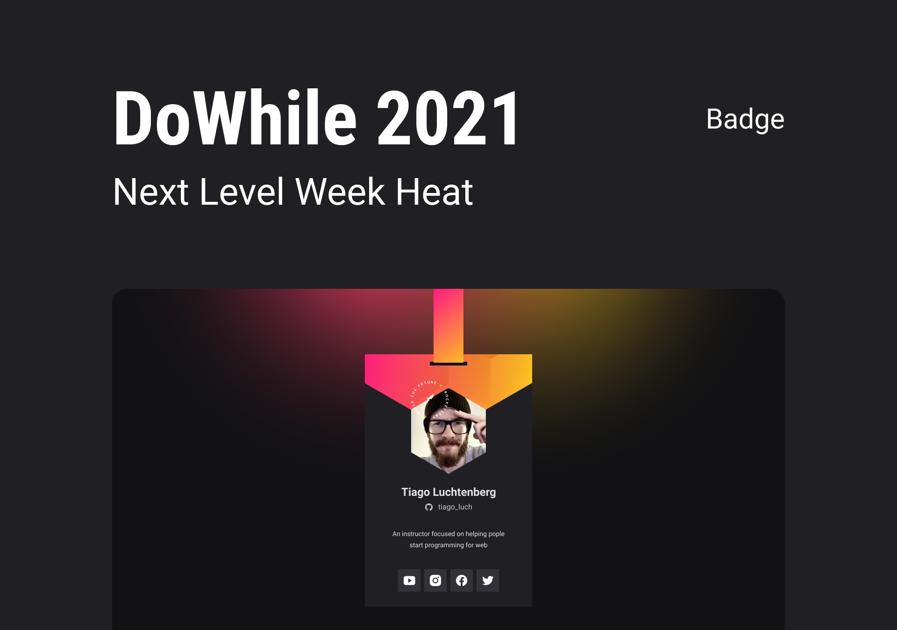
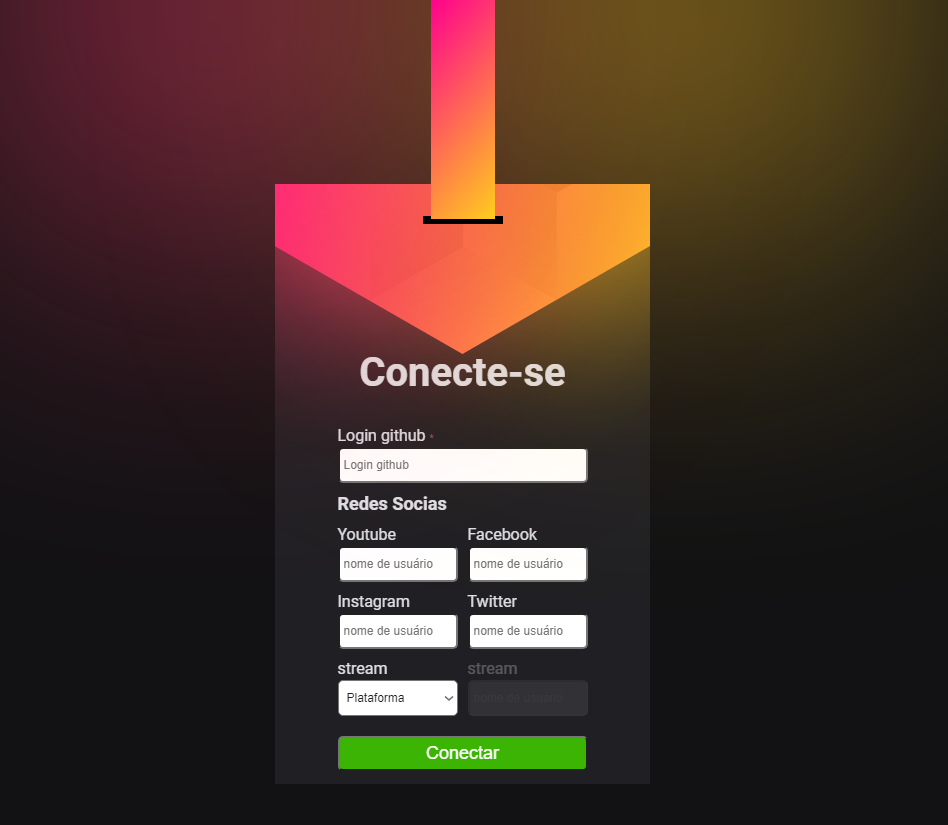

<h1 align="center">
  Crachá Virtual DoWhile
</h1>

  <a href="#-tecnologias">Tecnologias</a>&nbsp;&nbsp;&nbsp;|&nbsp;&nbsp;&nbsp;
  <a href="#-projeto">Projeto</a>&nbsp;&nbsp;&nbsp;|&nbsp;&nbsp;&nbsp;
  <a href="#-layout">Layout</a>&nbsp;&nbsp;&nbsp;|&nbsp;&nbsp;&nbsp;
  <a href="#memo-licença">Licença</a>&nbsp;&nbsp;&nbsp;|&nbsp;&nbsp;&nbsp;
  <a href="#test_tube-Experiência">Experiência</a>

 

  

 

  

## 🚀 Tecnologias

Esse projeto foi desenvolvido com as seguintes tecnologias:

- HTML
- CSS
- JavaScript

## 💻 Projeto

O Crachá virtual DoWhile é uma aplicação estática com o objetivo de mostrar as informações do usuário trazidas do GitHub API e inseri-las em um layout com a cara do evento DoWhile 2021

## 🔖 Layout

Você pode visualizar o layout do projeto através [desse link](https://www.figma.com/file/9Z2vxc8VTRuZpYjFalCMAl/Badge-Do-While2021-(Copy)?node-id=0%3A1). É necessário ter conta no [Figma](https://figma.com) para acessá-lo.

## :memo: Licença

Esse projeto está sob a licença MIT. Veja o arquivo [LICENSE](.github/LICENSE.md) para mais detalhes.

## :test_tube: Experiência

Como sempre é uma experiência unica participar de um NLW, e nesse especialmente eu quis ir álem, conseguir inova ou ingrementar a aplicação de alguma forma, seja fazendo um front-end melhor ou colocando algo novo como um backend. E nesse projeto como você precisa dos dados do usúario para ter um crachá e colocar esses dados diretamente no codigo, e isso não é muito pratico, então resolvi que ia fazer uma pagina de cadastro, para as pessoas colocarem os dados dela e poder ter seu proprio crachá.

  

Eu sei não ta a coisa mais linda do mundo, mas o meu foco era fazer isso funcionar e pra mim estudar mais a DOM, toda a parte do crachá foi feita pelo javascript, eu poderia ter usado EJS ou Nunjucks, mas preferir deixar bem simples e não perder a essência do NLW.

---

Quer participar de eventos e aulas muito massa? então faça parte desse foguete, Rocketseat :wave: [Participe da nossa comunidade!](https://discordapp.com/invite/gCRAFhc)
